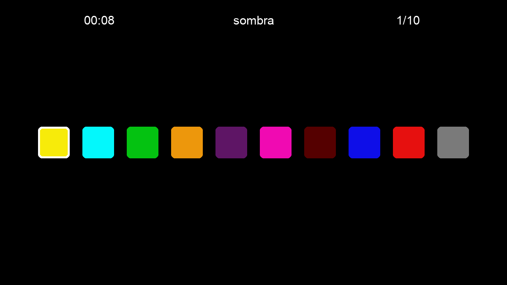

# 10 de 10

Puzzle game made in Python with pudu-ui and pyglet

# Usage

## Install dependencies

You will need to install *uv* first. Then you can do

`$ uv sync`

## Run it

`$ uv run main.py`

# Dependencies

It requires Python >= 3.13

- pudu_ui v0.2.2
- pyglet v3.0.dev3

# Download executable

If you want a free copy of the game you can get it on https://sombraxstudio.itch.io/10-de-10
